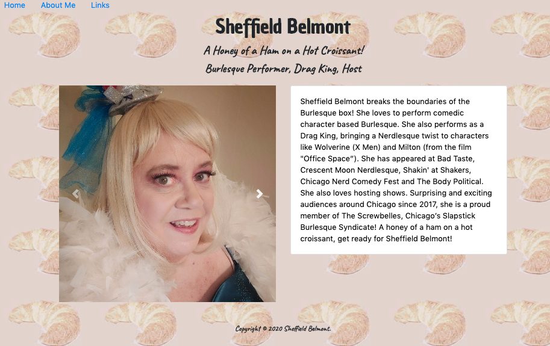

# SheffieldBelmont

This is a web site created for Sheffield Belmont, a Chicago based performer.

## Motivation
The purpose of this project is to engage Ms. Belmont with her audience and to showcase photos of Ms. Belmont.

## Responsibilities
Jill Westerfelhaus is responsible for all aspects of development:  design, coding, copywriting, photography, and background image. 

## Build Status
This project is complete.

## Tech Used
This project was built with HTML, CSS, and Bootstrap.

## URL of deployed website

https://sheffieldbelmont.com

 
